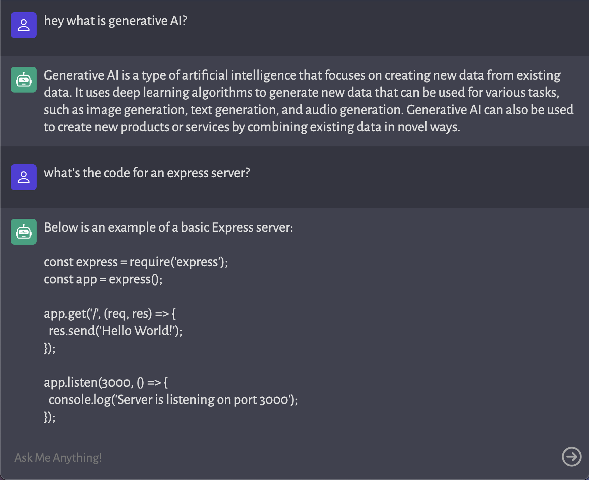

# A Simple Mock ChatGPT bot

    

## Description
This is a simple ChatGPT chatbot copy using Vite, Express, and Vanilla js.

## Installation
Clone the repository, navigate into the project directory, and run `npm install` to install all dependencies.

Remember to include your API keys in your `.env` file to make API calls.

## Usage
There's a couple of ways you can choose to run this app... First, you can choose to run both the server and the client locally! Alternatively, if you'd like to demo and host this app, you can host the backend with [render.com](https://render.com/) and the frontend with [vercel.com](https://vercel.com/).